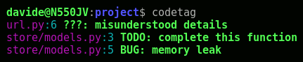
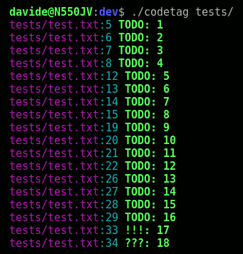

# codetag
Simple command that reveals code tags.



## What Are Codetags?
Programmers use comments to place reminders of sections of code that need closer inspection or review.
Examples of code tags are TODO, FIXME, BUG, HACK and many more.

A summary of the suggested tags:

- **TODO:** informal task.
- **FIXME:** problematic or ugbly code, needs refactoring or cleanup.
- **BUG:** a defect.
- **NOBUG:** wont fix or don't fix.
- **REQ:** satisfactions of specific, formal requirements.
- **RFE:** request for enhancement.
- **IDEA:** possible request for enhancement candidate.
- **???:** misunderstood details.
- **!!!:** alert.
- **HACK:** temporary code or workaraund.
- **PORT:** portability workaround.
- **CAVEAT:** non-intuitive implementation details.
- **NOTE:** note for the code reviewer.
- **FAQ:** require external explanation.
- **GLOSS:** definition for project glossary.
- **SEE:** reference to other code or documentation.
- **TODOC:** needs documentation.
- **CRED:** external credits.
- **STAT:** status.
- **RVD:** the code review was concluded.

For more information visit [https://www.python.org/dev/peps/pep-0350/](https://www.python.org/dev/peps/pep-0350/).

## Usage

Reveal the code tags in the current directory, recursively:
```bash
codetag
```

Provide a directory:
```bash
codetag path/to/project/directory/
```

The command support the following comment styles:
```
# TODO: task

// TODO: task

/*
 * TODO: task
*/
```

The full comment styles are in the `tests/test.txt` file.
Have a look inside that file and run the test with:
```bash
./codetag test/
```



## Installation
Copy the `codetag` executable file in a bin directory like `/usr/local/bin

## License
GNU General Public License 3

Copyright (C) 2017  Davide Muzzarelli  davide@muzzarelli.net